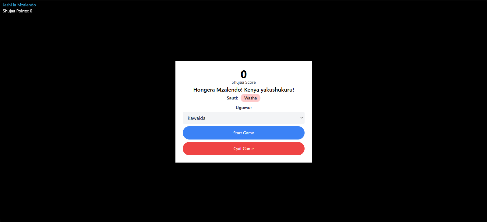
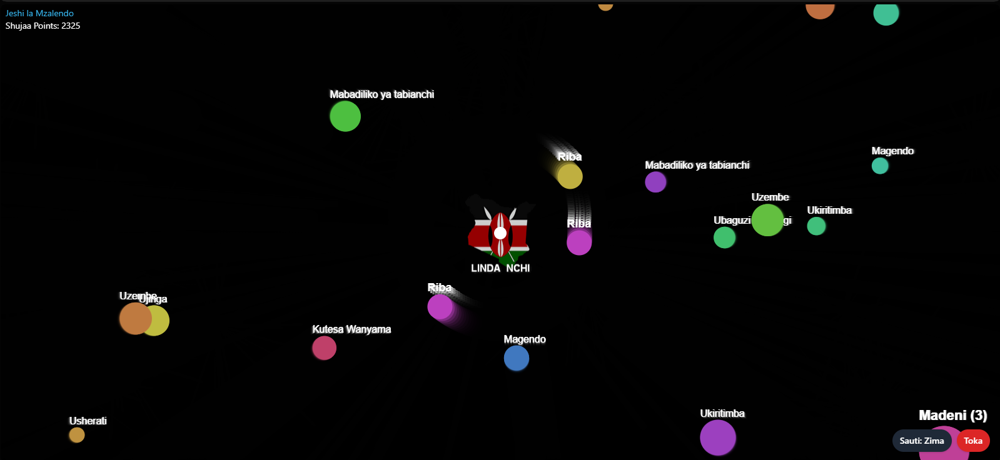
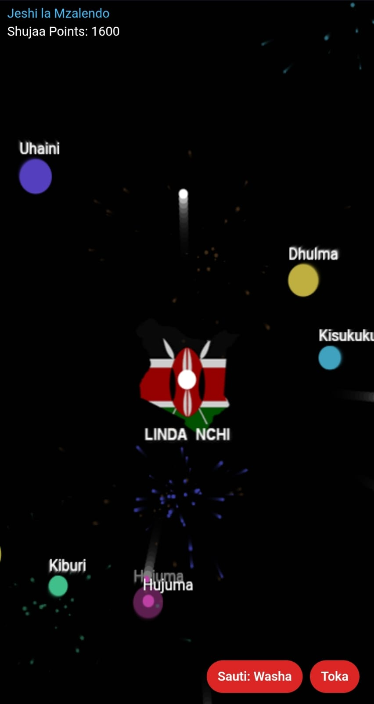
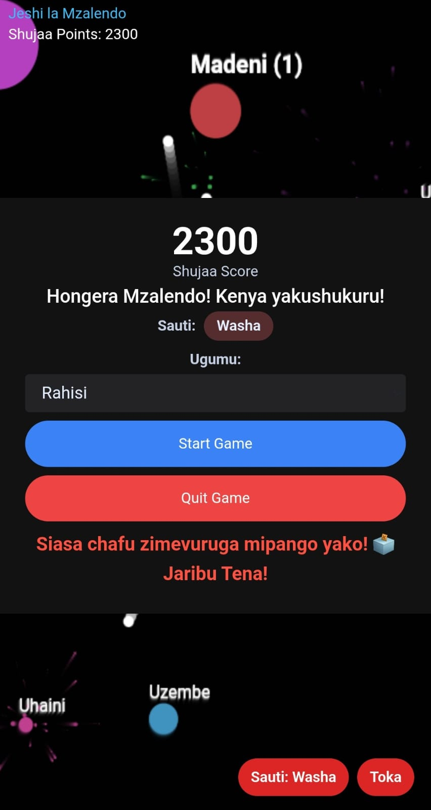

# Jeshi la Mzalendo (Patriot's Army)

This new version was created by [Ogenche](https://github.com/Ogenche), based on the original [Jeshi la Mzalendo video game](https://github.com/WafulaLukorito/Jeshi-la-Mzalendo--Patriot-s-Army--Video-Game) by [WafulaLukorito](https://github.com/WafulaLukorito).

## Play the Game!

You can play this version directly in your browser by visiting:
**[https://jeshi-la-mzalendo-jluk.netlify.app](https://jeshi-la-mzalendo-jluk.netlify.app)**

## New Features in this Version

- **Dynamic Difficulty Levels**: Tailors the challenge to skill level. Select difficulty before the battle begins:

  - **Rahisi (Easy)**: For new recruits. Enemies are slower and more forgiving.
  - **Kawaida (Medium)**: For a seasoned soldier. Balanced challenge.
  - **Ngumu (Hard)**: For the ultimate patriot. Enemies are fast and relentless.

- **Thematic Death Messages**: Your fight has meaning, and so does your defeat. When you fall in battle, the game provides a context-aware message of what caused your defeat (Ties gameplay to the story).

- **Full Swahili Language Support:** The entire game including all menus and in-game text has been translated into Swahili.

- **New Enemy Type:** A new, more challenging enemy ("Madeni" splits to "Riba") has been added to increase the game's difficulty and variety.
- **Sound Effects:** Added sound effects for a more immersive and engaging gameplay experience.
- **Improved User Interface (UI):**
  - An **exit button** (Toka) has been added for game closure from gameplay.
  - The **live score counter** has been improved for visibility and live track.
- **Responsive Screen Adaptation:** The game now adapts better to different screen sizes ensuring a consistent experience across various resolutions.

## How to Play

The objective is to defend the country by shooting down negative values.

- **Aim:** Use your mouse to aim the turret.
- **Fire:** Click the left mouse button to fire/ Touch to shoot if on phone.
- **Survive:** Don't let the enemies overwhelm you! The game ends when an enemy enters the capital.

## Tech Stack & Deployment

| Category            | Technology / Concept                          |
| ------------------- | --------------------------------------------- |
| **Core Logic**      | `HTML5 Canvas API`, `JavaScript`              |
| **Styling**         | `Tailwind CSS`                                |
| **Animation**       | `GSAP (GreenSock Animation Platform)`         |
| **Key Concepts**    | `Trigonometry & Physics`, `Computer Graphics` |
| **Deployment**      | `Netlify`                                     |
| **Version Control** | `Git / GitHub`                                |

## Screenshots

Here are some screenshots of the new version in action.

### **Desktop Version**

| Main Menu                                                 | In-Game Action                                        |
| --------------------------------------------------------- | ----------------------------------------------------- |
|  |  |

### **Mobile Version**

| Mobile Gameplay                                     | Game Over Screen                                    |
| --------------------------------------------------- | --------------------------------------------------- |
|  |  |

---

## Acknowledgements

- **This New Version:** Developed and maintained by [Ogenche](https://github.com/Ogenche).
- **Original Creator:** A big thank you to [WafulaLukorito](https://github.com/WafulaLukorito) for creating the original game. The original repository can be found [here](https://github.com/WafulaLukorito/Jeshi-la-Mzalendo--Patriot-s-Army--Video-Game).
